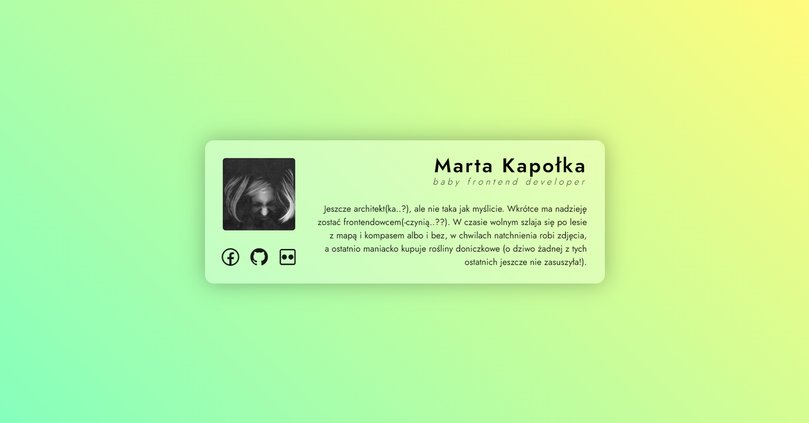

# buisness card

---

Static buisness card introducing me as a novice frontend developer.

LIVE: [buisness card](https://marta-kapolka.github.io/buisness-card/)

## Technologies used

- HTML5
- CSS3

## More about the project

### Goal

The goal of the exercise was to practice **basic HTML and CSS** by creating small project focusing on proper semantic HTML structure and using BEM Methodology.

### Main objectives

- build proper **semantic structure**
- use **BEM methodology**

## Credits

Project was build as an exercise during [WTF - co ten frontend](https://cotenfrontend.pl) course.
